#  KipuBank Smart Contract ! 

## Description

**KipuBank** is a Solidity smart contract that allows managing Ether deposits and withdrawals for multiple users in a secure and controlled manner. It includes:

* User deposits with a maximum bank fund limit.
* Withdrawals with a maximum limit per transaction.
* Tracking the number of deposits and withdrawals.
* Security against unauthorized calls and transfer failures (Ether sent using `call`).
* Functions to view individual and total bank balances, restricted to the owner or account holders.

---

## Main Features

* **Deposits**: Users can deposit Ether up to the bank's maximum capacity.
* **Withdrawals**: Users can withdraw Ether within their balance and the per-transaction limit.
* **Balance Viewing**:

  * Bank owner: can view all balances and transaction history.
  * Users: can view their own balance.
* **Security**: Protection against reentrancy, invalid values, and unauthorized access.

---

## Deploying on Remix

1. Open [Remix IDE](https://remix.ethereum.org/).
2. Create a new file named `KipuBank.sol` and paste the contract code.

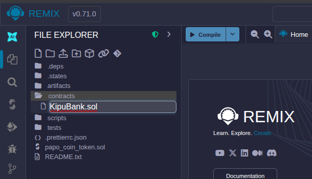

3. In the **Solidity Compiler** tab, select version `0.8.20`.
4. Click **Compile KipuBank.sol**.

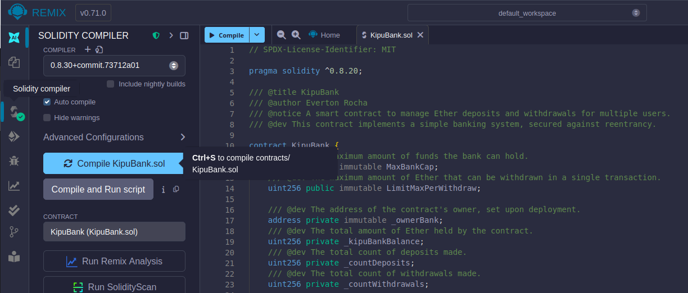

5. Go to the **Deploy & Run Transactions** tab.
6. Select the Ethereum account to act as the bank owner.
7. Enter constructor parameters:

   * `MaxBankCap`: maximum Ether the bank can hold (in wei).
   * `LimitMaxPerWithdraw`: maximum withdrawal per transaction (in wei).

   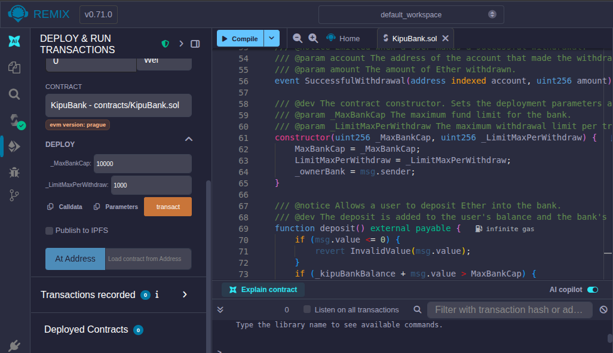

8. Click **Transact**.

---

## Contract in Etherscan

### 1. Contract created on etherscan

 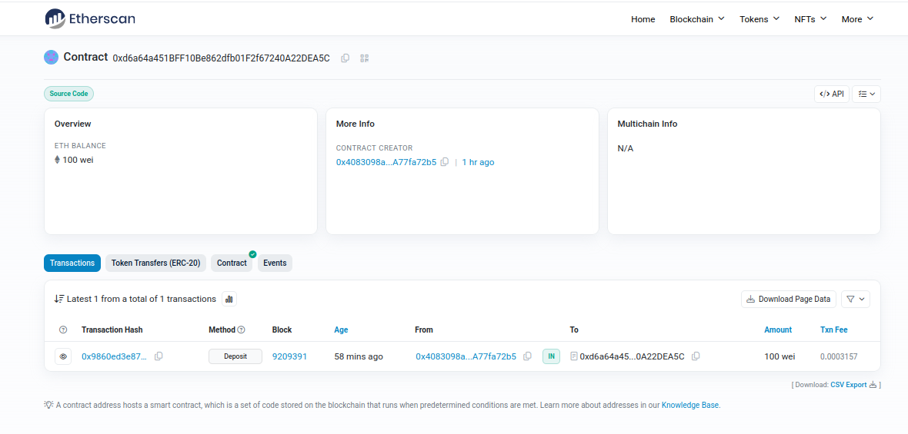

### 2. Necessary to verify and publish the contract

* Enter the contract details.

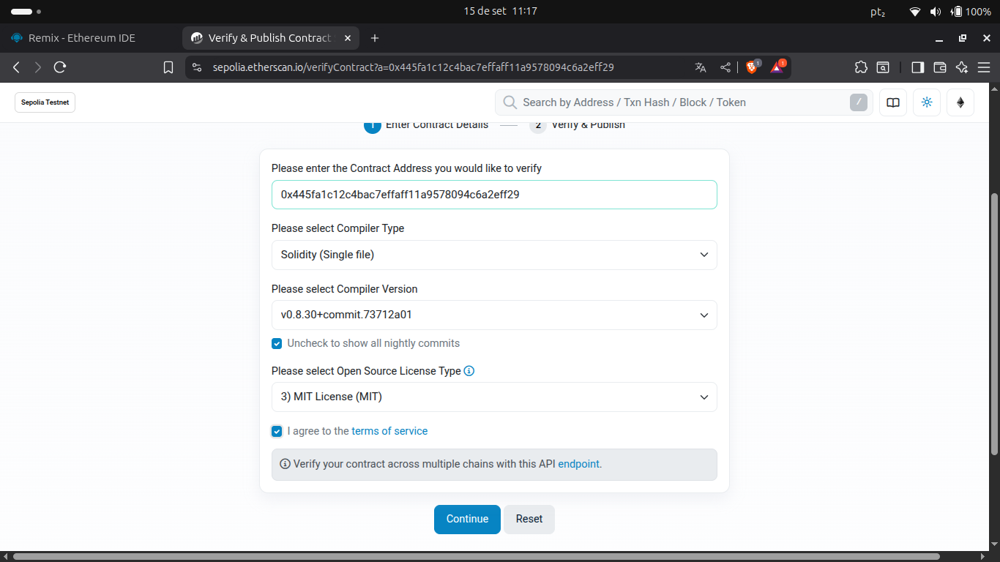

* Past the complete code and click verify.

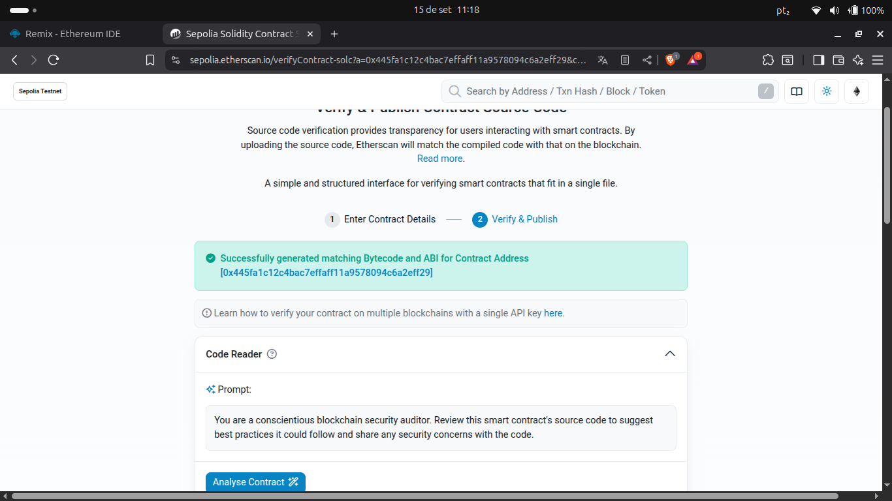

---

## Interacting with the Contract via Remix

### 1. Deposit Ether

* Select the `deposit()` function.
* Enter the amount in the **Value** field (in Ether).
* Click **Deposit**.

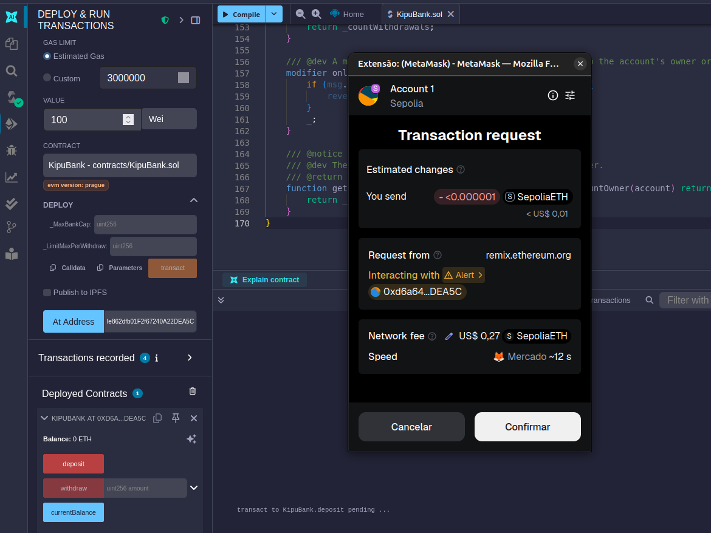

* The user balance is updated and the `SuccessfulDeposit` event is emitted.

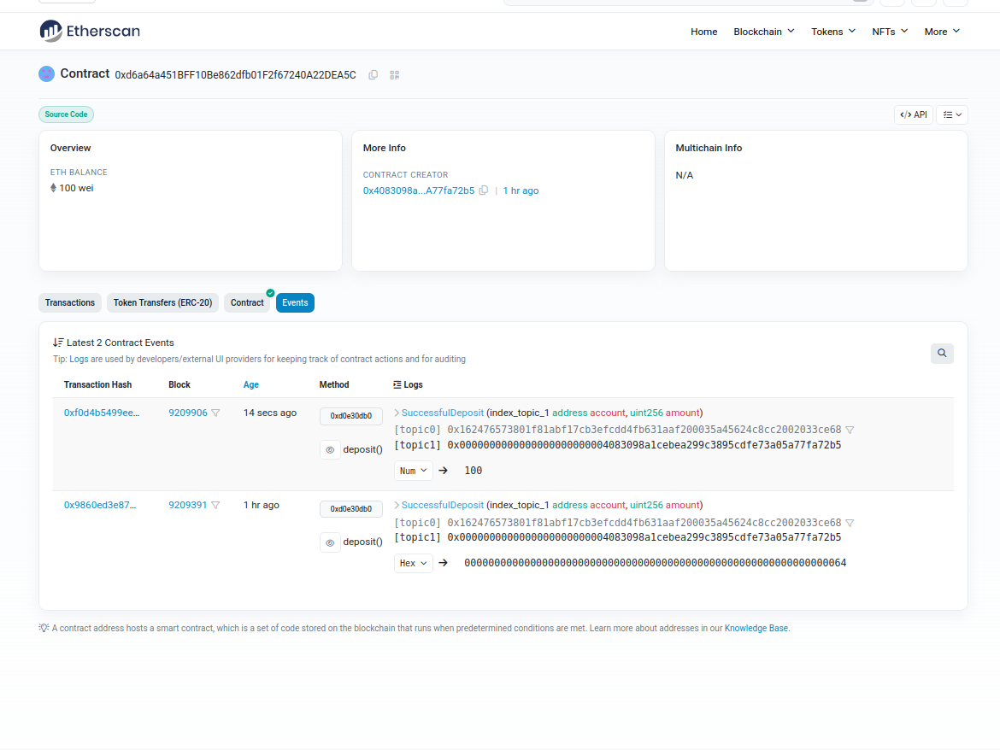

---

### 2. Withdraw Ether

* Select the `withdraw(uint256 amount)` function.
* Enter the amount you want to withdraw.
* Click **Withdraw**.
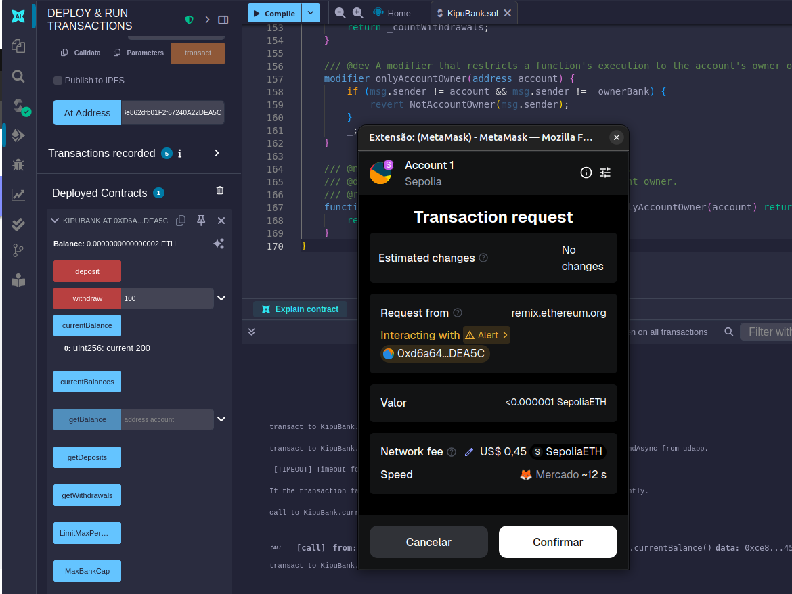

* The user balance decreases, and the `SuccessfulWithdrawal` event is emitted.

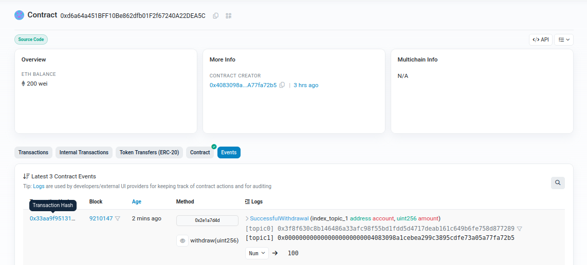

---

### 3. Check Balances

* **Bank Owner**:

  * `currentBalance()`: returns the total bank balance.

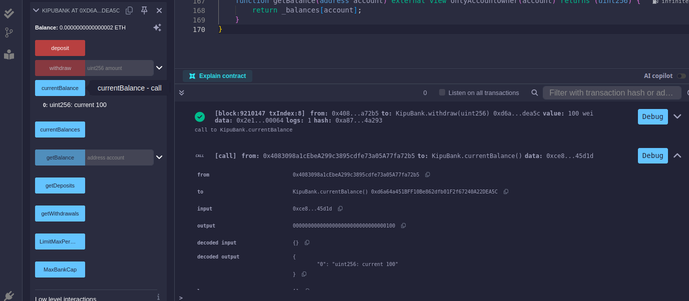

  * `currentBalances()`: returns all user balances.

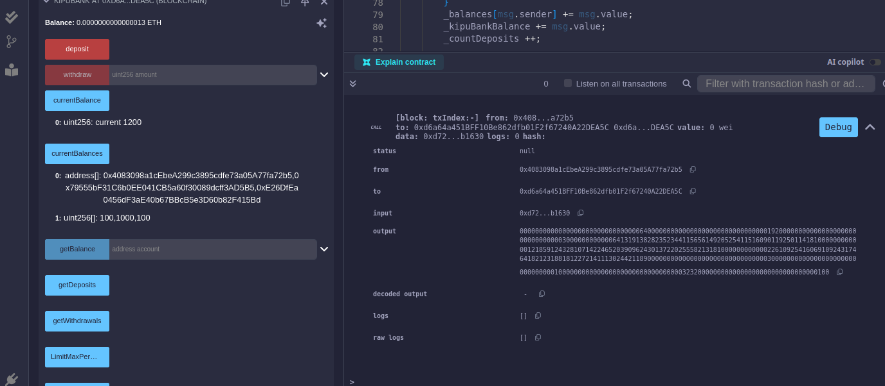

* **Regular User**:

  * `getBalance(address account)`: returns their own balance.

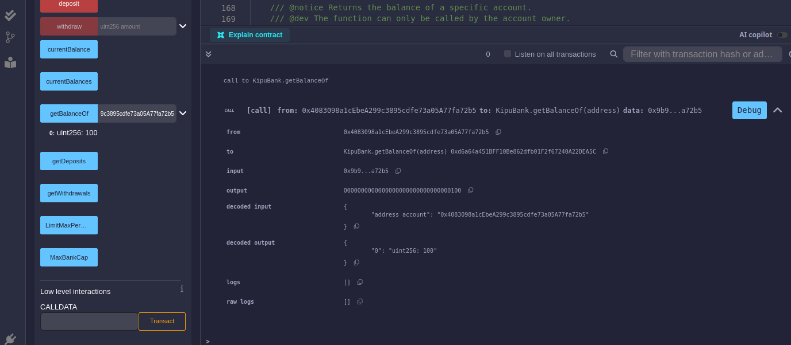

---

### 4. Transaction History

* **Bank Owner**:

  * `getDeposits()`: total number of deposits.

  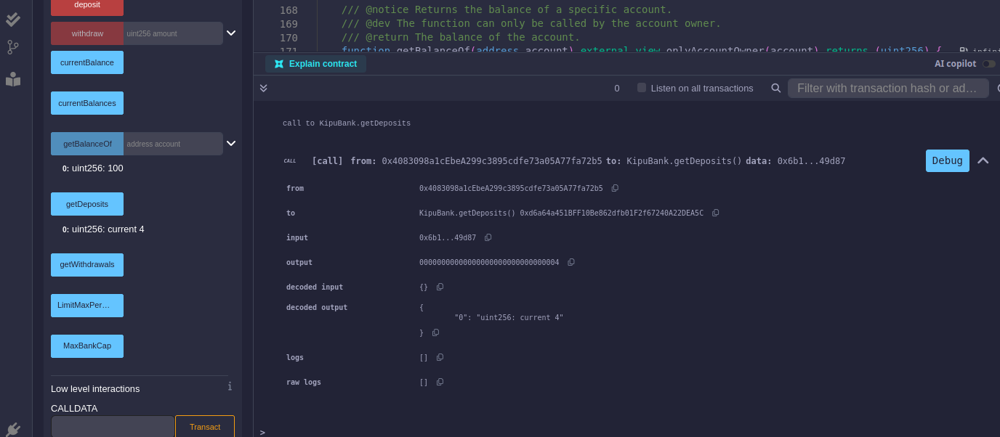

  * `getWithdrawals()`: total number of withdrawals.

  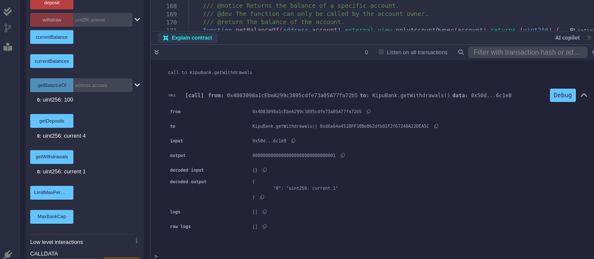

---

## Notes

* The contract follows the **Checks-Effects-Interactions** pattern to prevent reentrancy attacks.
* Only the bank owner can access aggregated balances and transaction history.
* Each user can only access their own balance.
